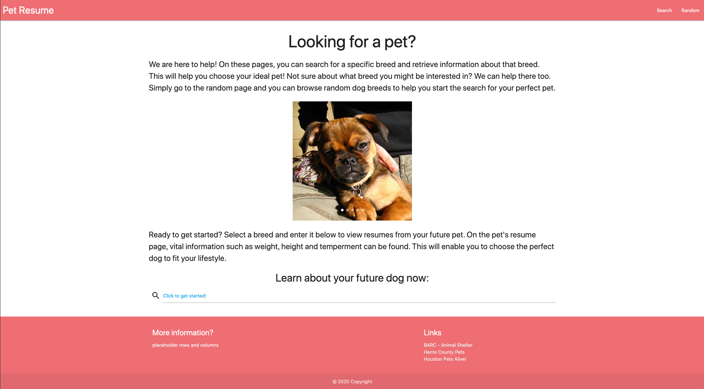

# petResume

Purpose: To provide an easy to use web application to allow users to search for information about dog breeds to help them decide on a future pet.

When a user inputs a dog breed on the search page, an autocomplete function helps them get to the exact breed they are looking for.  This funcion queries thedogapi.com to return choices responding to the users text input.

When the user is submits their choice, relevant information from thedogapi.com is retrieved and displayed on the page.  For the image displayed on the page, dogceo.com api is called to retrieve pictures of the chosen breed.  If there are no images available from dogceo.com, the image function falls back to thedogapi.com to retrive an image.

Users can enter a new breed and obtain the information about that breed at any time.

If the user is unsure about what breed to search for, the random page will display random dog pictures and when the image is clicked, a short description is displayed.

Future development will include a function to query rescuegroups.org api to point the user to a rescue group that could have a possible match for their chosen pet.

Deployed url:
![url]https://chefjaypeek.github.io/petResume/index.html
Code Repo:
![url]https://github.com/ChefJayPeek/petResume
Screenshot:

